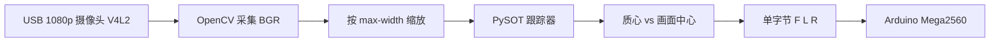

# Jetson Nano 视觉追踪方案说明

本仓库在 Jetson Nano 上的**视觉追踪 + 小车跟随**由 **`jetson_follow_track.py`** 实现：**USB 1080p 摄像头** → **PySOT 单目标跟踪** → 根据目标与画面中心的偏差，通过 **`comm.py`** 向 Arduino 发送 **`F` / `L` / `R`**（中心带内为 **`F`**），退出时 **`S`**。

环境安装见 **`JETSON_NANO_SETUP.md`**。

---

## 1. 方案架构



- **跟踪**：仓库内 **`pysot-master/`**（与 [STVIR/pysot](https://github.com/STVIR/pysot) 同源的新版树，**优先**；无则旁路 **`pysot/`**）+ `experiments/.../config.yaml` + **`model.pth`**（见 `MODEL_ZOO.md`，Nano 建议 MobileNetV2 配置）。  
- **推理设备**：`config.yaml` 中 `CUDA` 与 `torch.cuda.is_available()` 共同决定是否用 GPU。  
- **串口**：未连接或打开失败时 **`comm.py` 不写串口**（不抛错），便于先做纯视觉验证。

---

## 2. 视频输入：USB 摄像头

- **`--device`**：OpenCV 设备号，一般为 **`0`**。  
- **`--cap-width` / `--cap-height`**：默认 **1920×1080**；相机不支持时会回落到驱动实际能力。  

在 **Linux / Jetson** 上，脚本会优先用 **`cv2.CAP_V4L2`** 打开摄像头，失败则回退默认后端，有利于 USB 相机稳定出流。

---

## 3. 运行模式

### 3.1 有显示器：手动框选第一帧目标

```bash
cd ~/nano-jetson-car
source ~/venv-car/bin/activate
export ROBOT_SERIAL_PORT=/dev/ttyUSB0
python jetson_follow_track.py --device 0 \
  --snapshot pysot-master/experiments/siamrpn_mobilev2_l234_dwxcorr/model.pth
```

首帧用鼠标框选目标，窗口中 **`q`** 退出。

### 3.2 无显示器：必须指定初始框

仅 **`--init-bbox`** 时，OpenCV 仍会尝试建窗口；在 **SSH 无 `DISPLAY`** 环境下会失败。

请使用 **`--no-display`**（**必须**同时提供 **`--init-bbox`**）：

```bash
python jetson_follow_track.py --device 0 --no-display \
  --snapshot pysot-master/experiments/siamrpn_mobilev2_l234_dwxcorr/model.pth \
  --init-bbox 200,180,80,120
```

- **`x,y,w,h`**：均为 **按 `--max-width` 缩放后的跟踪图**上的像素（默认 **`--max-width 640`**）。  
- 周期性日志：默认每 **`--log-every 30`** 帧打印一次 bbox / 质心 / 指令（**`F`/`L`/`R`**）；**`--log-every 0`** 关闭。  
- 结束： **`Ctrl+C`**（`finally` 中会 **`comm.stop()`** 并释放摄像头）。

---

## 4. 关键参数调参（Nano 上常用）

| 参数 | 作用 | Nano 建议 |
|------|------|-----------|
| `--max-width` | 跟踪输入宽度，越小越快 | 默认 **640**；仍卡可试 **480** |
| `--cap-width` / `--cap-height` | 采集分辨率 | 帧率低时用 **1280×720** 或 **640×480** |
| `--deadband` | 质心与画面中心差小于该像素时发 **前进** | 车体易抖可略增大；过大则不爱转向 |
| `--config` | PySOT 配置 yaml | 默认 MobileNetV2 路径，与 README 一致 |
| `--snapshot` | **`model.pth`** | 与 `config.yaml` 匹配 |

---

## 5. 与 README 的对应关系

| README 描述 | 本方案 |
|-------------|--------|
| USB 1080p | **`--cap-width` / `--cap-height`**，默认 1920×1080 |
| `ROBOT_SERIAL_PORT` 等 | 与 **`comm.py`** 一致；可用 **`--serial-port`** 覆盖 |
| 无头 SSH | **`--no-display` + `--init-bbox`** |

---

## 6. 验收顺序建议

1. **`python -c "import torch; print(torch.cuda.is_available())"`** 为真。  
2. 有显示器 **`selectROI`** 能稳定跟踪。  
3. **`--no-display` + `--init-bbox`** 做 SSH 无头验证。  
4. 最后接 Arduino，低速实测 **`F`/`L`/`R`** 与机械结构是否一致。

---

*实现文件：`jetson_follow_track.py`、`comm.py`；依赖安装：`JETSON_NANO_SETUP.md`。*
